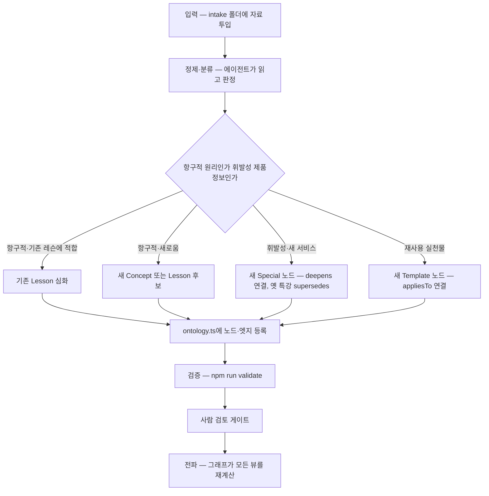

# AI Builder School 2.0 — 아키텍처 설계

> 상태 — 설계 승인 대기 · 작성 2026-05-19 · 범위 §0(아키텍처 토대)에 한정
> 이 문서는 2.0의 **토대 스펙**이다. 입력 파이프라인·레슨 심화·특강은 각각 별도 스펙으로 분리한다.
> 베이스 — production `main` (v1.0.1). 8-Stage 모델. 이전 시도 `claude/recovery-v0.3`은 13-Phase(v0.2) 기반이라 데이터 모델이 달라 베이스로 쓰지 않는다. 본 문서는 recovery-v0.3의 §0 스펙을 8-Stage 기준으로 다시 쓴 것이다.

---

## 0. 배경과 목적

### 0-1. 왜 2.0인가

`main`(v1.0.1)은 8개 Stage 사다리 · 84개 레슨 · 6개 Journey의 **선형 커리큘럼**이다. v1.0은 안정된 제품이고, 8-Stage 재설계로 학습 동선은 정돈됐다. 그러나 두 가지 구조적 한계가 남는다.

- **단일 선형 경로** — Stage 사다리는 하나다. 출발점이 다른 학습자(입문자·실무자·엔지니어)가 같은 줄을 선다. Journey가 추천 Stage를 제시하긴 하지만, 콘텐츠 사이의 관계 자체는 모델에 없다 — "이 레슨이 어떤 개념을 가르치는가", "이 빌드가 어떤 원리를 보여주는가"가 데이터로 표현되지 않는다.
- **제품 변동성을 흡수할 장치 부재** — 특정 제품·버전에 묶인 콘텐츠는 빠르게 낡는다. AI 시장은 6개월마다 뒤집힌다. v1.0의 평평한 레슨 구조에는 항구적 원리와 휘발성 제품 정보를 분리하는 장치가 없어, 시장이 흔들릴 때마다 수십 개 레슨을 손봐야 한다.

2.0은 이 둘을 그래프 레이어로 푼다. 콘텐츠 사이의 관계를 1급 데이터(엣지)로 올리고, 항구/휘발을 타입과 필드로 못박는다.

### 0-2. 2.0의 한 줄 정의

AI Builder School 2.0은 **입력으로 자라는 살아있는 지식 그래프**다. 원리는 항구적 코어로 안정되고, 제품 종속 정보는 휘발성 엣지로 분리되어, 급변하는 AI 시장에서 항상성을 유지한다.

### 0-3. 설계 목표 ("규모 +50% · 시간 감소"의 해석)

- **시스템은 +50% 성장한다** — 그래프 레이어 · 입력 파이프라인 · 특강 체계가 새로 생긴다.
- **필수 강의 시간은 줄어든다** — 현재 84개 레슨을 통합·감축하고, 살아남는 레슨은 각각 2배 깊어진다. 그래프 기반 개인화 경로로 학습자별 필수 경로가 짧아진다. 통합 후 목표 레슨 수와 구체 매핑은 레슨 심화 스펙(2번)에서 확정한다.
- **콘텐츠 총량이 아니라 시스템에 투자한다.**

---

## 1. 확정된 토대

이전 세션의 명확화 질문으로 확정된 분기다.

| 결정 | 선택 | 함의 |
|---|---|---|
| 온톨로지 깊이 | **그래프는 연결층** | Stage 사다리는 유지. 그 위에 그래프를 얹는다. 전면 노드 컬렉션(척추)은 기각 |
| 규모 방향 | **레슨 통합·감축, 시스템이 +50%** | 현재 84레슨을 통합·감축, 각 2배 심화 |
| DSS 관계 | **형제 사이트** | 그래프 모델 패턴·디자인 언어 공유, 코드·콘텐츠 분리, 상호 링크 |
| 그래프 코드 배치 | **접근법 A** | 중앙 `ontology.ts`(엣지·렌즈) + 노드 메타데이터는 각 콘텐츠 파일 |
| Concept 노드 | **1급 노드로 승격** | 개념이 독립 위키 항목. "LLM 위키"에 가장 가까운 선택 |

---

## 2. 노드 모델

2.0의 노드 타입은 5종이다. 핵심은 **항구/휘발을 타입과 필드로 못박는 것** — 이것이 항상성의 기계장치다.

| 노드 | 성격 | 기본 휘발성 | 신규 |
|---|---|---|---|
| **Concept 개념** | 항구적 코어 — 원자적 지식 단위, 위키 항목 | `evergreen` / `evolving` | ⭐ |
| **Lesson 레슨** | 항구적 코어 — 플랫폼 비종속 원리, 7-step 학습 루프 | `evergreen` / `evolving` | — |
| **Special 특강** | 휘발성 엣지 — 제품·버전 종속, 인터랙티브 슬라이드 | `volatile` | ⭐ |
| **Project 프로젝트** | 캡스톤형 빌드 | `evolving` | — |
| **Template 템플릿** | 학습자가 들고 나가는 재사용 산출물 | 혼합 | — |

`Stage`와 `Journey`는 노드가 아니라 **렌즈(뷰)**다. 그래프를 선형으로 보여주는 방식이며 §4-3에서 정의한다.

### 2-1. 휘발성 필드 — 항상성의 핵심

모든 노드는 `volatility` 값을 가진다.

- `evergreen` — 원리. 검토 주기가 길다(연 1회 권장).
- `evolving` — 원리지만 도구 예시가 늙는다. 주기적 갱신이 필요하다.
- `volatile` — 특정 제품·버전에 종속된다. `reviewBy` 날짜를 필수로 가지며, 그 날짜가 지나면 UI에 "신선도 경고"가 자동으로 뜬다.

시장이 흔들리면 `volatile` 노드(특강)만 교체·보관되고 `evergreen` 코어는 손대지 않는다. 이것이 "급변 시장에서 항상성"의 실제 작동 방식이다.

### 2-2. 노드 상태와 `archived` 처리

모든 노드는 `status` 값을 가진다 — `draft` / `published` / `archived`.

`supersedes`로 대체된 옛 Special 노드는 `archived`가 된다. 보관된 노드의 라우팅 동작을 다음으로 고정한다.

- **404를 내지 않는다.** `generateStaticParams`는 `archived` 노드도 포함해 정적 페이지를 계속 생성한다 — 외부 링크가 깨지지 않게.
- 페이지 상단에 "이 콘텐츠는 최신 버전으로 대체되었습니다" 배너 + 대체 노드로의 링크를 렌더한다.
- 렌즈(Stage·Journey)의 기본 표시에서는 제외된다 — "보관 자료" 토글로만 노출.

### 2-3. Concept 노드의 범위 제한

이번 세션은 Concept "노드 타입과 관계"를 정의하는 데까지만 한다. 개념 위키 항목을 실제로 집필하는 일은 별도 콘텐츠 작업이다. §0 구현은 기존 레슨의 `coreConcepts`에 반복 등장하는 영문 핵심 개념 ~10개를 손으로 골라 `concepts.ts` 시드로 만들고 `teaches` 엣지로 연결한다(§7 참조).

### 2-4. Template의 정체

흥미 유발은 템플릿이 아니다 — 그것은 레슨의 `hook`·`problemScenario`가 한다. 템플릿은 **학습자가 레슨을 떠난 뒤에도 계속 쓰는 재사용 산출물**이며 가장 실천적인 노드다. kinds는 1.0과 동일하게 `prompt` / `mission` / `checklist`.

미션·체크리스트는 레슨 *안*에서 일회성으로 쓰이고, 그것이 도메인을 넘어 재사용될 가치가 있을 때 Template 노드로 **승격**된다. 레슨의 `outputs` 파일 중 범용적인 것이 Template로 올라가며 `appliesTo`로 원래 레슨에 역연결된다. 승격은 한 방향(레슨 산출물 → 템플릿)이며, 이 정의로 미션·체크리스트와의 혼선이 사라진다.

### 2-5. 노드 id 규칙

그래프의 모든 노드는 전역 고유 id를 가진다. 규칙을 **`{kind}:{slug}`**로 고정한다.

- 예 — `lesson:hallucination-verification`, `concept:human-in-the-loop`, `special:codex-cloud-2026-05`, `project:project-doc-qa`, `template:tpl-4axis-prompt`.
- `slug`은 이미 타입별로 고유하므로, 앞에 `kind:`를 붙이면 타입 간 충돌 없이 전역 고유가 된다.
- 기존 콘텐츠 객체의 `id` 필드(`lesson-01`, `project-doc-qa` 등)는 **그대로 둔다** — 84개 레슨 객체를 건드리지 않는다. 그래프 노드 id는 각 노드의 `slug`에서 *유도*한다.
- `Edge.from` / `Edge.to` / `Lens.nodeIds`는 모두 이 `{kind}:{slug}` 형식을 쓴다.

---

## 3. 엣지 모델

노드 간 관계는 전부 `src/content/ontology.ts`에 모은다. 8종이다.

| 엣지 | from 타입 → to 타입 | 의미 |
|---|---|---|
| `prerequisite` | 노드 → 노드 | A를 알아야 B로 간다 |
| `teaches` | Lesson → Concept | 이 레슨이 가르치는 개념. 위키 역참조의 근거 |
| `demonstrates` | Project·Special → Lesson·Concept | 이 빌드·특강이 어떤 원리를 보여주는가 |
| `deepens` | Special → Lesson · Lesson → Lesson | 휘발성 특강이 어느 항구적 레슨을 심화하는가 |
| `appliesTo` | Template → Lesson·Special | 이 템플릿이 쓰이는 곳 |
| `relatedTo` | Concept ↔ Concept | 위키식 횡적 연결 (DSS `relatedConcepts`와 동형) |
| `supersedes` | Special → Special | **항상성 장치** — 새 특강이 옛 특강을 대체. 옛 노드는 `archived` |
| `partOfJourney` | Lesson·Special·Project → Journey | 어느 여정 경로에 속하는가 |

각 엣지의 from/to 타입 제약은 위 표가 규범이며, §4-4의 검증이 이를 강제한다.

### 3-1. `supersedes` + `deepens` 조합

이 두 엣지의 조합이 항상성을 만든다. 예 — 코덱스가 새 서비스를 출시한 경우.

1. 새 `Special` 노드 생성
2. 그 특강이 `deepens`로 항구적 레슨에 매달림
3. 같은 주제의 옛 특강이 있으면 `supersedes`로 대체 → 옛 노드는 `archived`로 전환(코어를 건드리지 않음)

학습자가 보는 것은 "원리(레슨)는 그대로, 최신 적용(특강)만 갱신"이다.

---

## 4. 그래프의 물리적 구조

접근법 A — 기존 콘텐츠 파일은 유지하고, 그래프만 새 파일에 모은다.

### 4-1. 파일 배치

- `src/content/lessons.ts` 등 기존 콘텐츠 파일 — **유지**. 노드 본문과 고유 메타데이터(`volatility`·`reviewBy`·`status`)가 여기 산다.
- `src/content/stages.ts` · `src/content/journeys.ts` — **유지**. Stage·Journey의 풍부한 필드(`titleKo`·`level`·`estimatedHours`·`outcomes`·`subGroups` 등)는 그대로 두고, 렌즈는 이 파일에서 *유도*된다(§4-3).
- `src/content/ontology.ts` — **신설**. 노드 레지스트리(기존 콘텐츠 배열을 import해 id로 인덱싱) + 엣지 배열 + 렌즈 배열.
- `src/lib/types.ts` — 노드 메타 필드·새 노드 타입(`Concept`·`Special`)·엣지 타입·렌즈 타입 추가.
- `src/lib/content.ts` — 그래프 질의 헬퍼(역참조·관련 노드·렌즈 전개) + `validateContent()` 그래프 규칙 추가.

### 4-2. 타입 스케치

```ts
// 휘발성 — 항상성의 핵심
type Volatility = "evergreen" | "evolving" | "volatile";
type NodeStatus = "draft" | "published" | "archived";

// 모든 노드 콘텐츠 타입에 옵셔널로 합쳐지는 공통 필드.
// 별도 레지스트리에 중복 저장하지 않는다 — 각 콘텐츠 객체가 단일 진실 공급원.
interface NodeMeta {
  volatility?: Volatility;   // 미지정 시 마이그레이션 기본값 적용 (§7)
  reviewBy?: string;         // ISO 날짜. volatility === "volatile"이면 필수
  status?: NodeStatus;       // 미지정 시 "published"로 간주
}

type NodeKind = "concept" | "lesson" | "special" | "project" | "template";

// 신규 노드 — Concept (coreConcepts에서 유도되는 위키 항목)
interface Concept extends NodeMeta {
  id: string;
  slug: string;
  titleKo: string;
  titleEn?: string;
  summary: string;           // 1~2문장 정의
  tags: string[];
}

// 신규 노드 — Special (특강)
interface Special extends NodeMeta {
  id: string;
  slug: string;
  titleKo: string;
  titleEn?: string;
  summary: string;
  product: string;           // 다루는 제품·서비스 (예 "Codex Cloud")
  format: "interactive-slides";
  estimatedMinutes: number;
  reviewBy: string;          // Special은 항상 volatile → 필수
  tags: string[];
}

type EdgeType =
  | "prerequisite" | "teaches" | "demonstrates" | "deepens"
  | "appliesTo" | "relatedTo" | "supersedes" | "partOfJourney";

interface Edge {
  from: string;              // "{kind}:{slug}" 노드 id
  to: string;                // "{kind}:{slug}" 노드 id
  type: EdgeType;
}

// 렌즈 — 그래프를 선형으로 보여주는 뷰
interface Lens {
  id: string;
  kind: "stage" | "journey";
  title: string;
  nodeIds: string[];         // 순서 있는 노드 id 목록 (Lesson·Special·Project 혼합 가능)
}

// 그래프 노드 레지스트리 항목
interface GraphNode {
  id: string;                // "{kind}:{slug}"
  kind: NodeKind;
  slug: string;
  title: string;
  volatility: Volatility;
  status: NodeStatus;
  reviewBy?: string;
}
```

기존 `Lesson`·`Project`·`ContentTemplate` 인터페이스에는 `NodeMeta` 필드를 옵셔널로 합친다(`interface Lesson extends NodeMeta`). 옵셔널이므로 기존 84개 레슨·프로젝트·템플릿 객체는 수정 없이 컴파일된다.

### 4-3. 렌즈 — Stage와 Journey

Stage와 Journey는 노드가 아니라 렌즈다. 단 **`stages.ts`·`journeys.ts` 파일은 삭제되지 않는다.**

- `stages.ts`의 `Stage` 객체는 `titleKo`·`level`·`estimatedHours`·`outcomes`·`subGroups` 등 렌즈에 없는 풍부한 메타데이터를 계속 보유한다. `getStageById()` 같은 기존 호출 경로는 그대로 동작한다.
- `ontology.ts`의 렌즈는 `stages.ts`에서 *유도*된다 — `Stage.lessonSlugs` 배열이 `Lens.nodeIds`(순서 있는 `{kind}:{slug}` 목록)로 변환된다. 렌즈에는 레슨뿐 아니라 Special·Project도 끼울 수 있다(예 — Stage 4 끝에 "코덱스 신기능 특강").
- Journey 렌즈도 같은 방식 — `journeys.ts`의 `recommendedLessons`에서 유도된다.

즉 `stages.ts`·`journeys.ts`는 Stage·Journey의 정본으로 남고, 렌즈는 그것을 그래프 뷰로 투영한 파생물이다.

**Stage 4·6의 `subGroups`** — Stage 4·6은 내부에 sub-group(4a/4b/4c·6a/6b/6c)을 가진다. §0의 Stage 렌즈는 `Stage.lessonSlugs`를 순서대로 펼치며 sub-group 경계를 평탄화한다. sub-group을 더 가는 입자의 렌즈로 모델링할지는 §0 범위 밖이며 후속 스펙에서 정한다.

### 4-4. 그래프 무결성 검증 규칙

`npm run validate`에 다음 검사를 추가한다. `validate`는 그래프 무결성 게이트이고, `npm run check`(lint + typecheck + validate + build)는 전체 통합 게이트다.

1. **끊긴 엣지** — `Edge.from`/`to`가 존재하지 않는 노드 id를 가리키면 오류.
2. **엣지 타입 제약** — §3 표의 from-타입/to-타입과 어긋나는 엣지는 오류 (예 — `teaches`의 to가 Concept가 아니면 오류).
3. **prerequisite 순환** — `prerequisite` 엣지가 사이클을 이루면 오류(A→B→A).
4. **고아 노드** — 어떤 종류의 인바운드·아웃바운드 엣지도 없는 노드는 경고. (렌즈 미포함은 오류가 아니다 — Concept는 렌즈에 없을 수 있다.)
5. **중복 엣지** — 같은 `(from, to, type)` 조합이 둘 이상이면 오류.
6. **휘발성 정합** — `volatility === "volatile"`인데 `reviewBy`가 없으면 오류.

1.0의 Harness 6축(평가 훅)을 그대로 따른다 — `validate` 실패 시 자동 수정하지 않고 보고서를 사람에게 올린다.

---

## 5. 성장 엔진 — 노드 수용 계약

"성장 엔진"의 핵심이며, 아키텍처가 반드시 정의하는 **노드 수용 계약(intake contract)**이다. 파이프라인의 세부 메커니즘(정제 에이전트·intake 폴더 포맷·분류 휴리스틱)은 별도 스펙(1번)이다. 이 문서는 흐름과 계약만 고정한다.

### 5-1. 전파 흐름



### 5-2. 전파의 의미

노드 하나 + 엣지 몇 개만 `ontology.ts`에 등록하면 나머지는 그래프가 한다.

- 그 노드를 `teaches`·`deepens`·`demonstrates`하는 노드들의 "관련 자료"가 자동 갱신
- Stage 렌즈가 새 Special을 제 위치에 자동 노출
- Journey 렌즈가 `partOfJourney`를 따라 해당 여정 학습자에게 자동 노출
- 위키 역참조(`teaches` 반대 방향)가 자동 생성

수동으로 수십 개 레슨을 헤집지 않는다. 이것이 연결층 그래프를 택한 이유다.

### 5-3. 수용 계약 (이 문서가 고정하는 것)

- 파이프라인의 출력은 **`npm run validate`를 통과하는 유효한 노드 + 엣지**여야 한다.
- 휘발성 노드는 `reviewBy`를 반드시 포함한다.
- 머지 전 **사람 검토 게이트는 생략 불가**다. AI Builder School 자신의 Harness 3축(자동 수정 금지, 사람이 결정)과 정제 품질 보증을 위해서다.

---

## 6. 사람-에이전트 분담

2.0은 사람과 에이전트의 협업으로 굴러간다. 분담을 명시한다.

- **사람이 정한다** — 흐름, 방향, 느낀점, 콘텐츠의 톤, 무엇을 코어로 둘지, 머지 승인.
- **에이전트가 한다** — 기술적 요소를 영리하게. 정제·분류 *제안*, 노드·엣지 초안, 타입·검증, 마이그레이션.
- **항상 사람 검토** — 에이전트는 제안하고 사람이 승인한다. 콘텐츠 양이 많지 않으므로 제안 품질이 좋으면 사람 검토로 충분히 운영된다.

---

## 7. 마이그레이션 경로 — v1.0 → 2.0

빌드를 한 번도 깨지 않고 넘어간다. 1~4단계가 §0 구현 범위다. 각 단계 끝에 `npm run check`가 통과해야 한다.

1. **타입 확장 (무손상)** — `types.ts`에 `NodeMeta` 필드를 *옵셔널*로 추가하고 `Lesson`·`Project`·`ContentTemplate`에 합친다. 새 인터페이스(`Concept`·`Special`·`Edge`·`Lens`·`GraphNode`)를 추가한다. 옵셔널·추가이므로 기존 84레슨 무영향.
2. **`ontology.ts` 신설** — 기존 84레슨·프로젝트·템플릿을 노드로 등록(`{kind}:{slug}` id 유도). 엣지 상당수를 기존 데이터에서 자동 유도한다.
	- `Lesson.prerequisites`(slug 목록) → `prerequisite` 엣지
	- `Lesson.targetJourneys` → `partOfJourney` 엣지 (단 `targetJourneys`가 정본으로 남고, 엣지는 읽기 전용 파생물 — §9 참조)
	- `Project.targetJourneys` → `partOfJourney` 엣지 (Project도 `targetJourneys` 필드를 가진다 — §9)
	- `coreConcepts`에 반복 등장하는 영문 핵심 개념 ~10개 → `Concept` 노드 시드 + `teaches` 엣지 (수동 선별)
3. **Stage·Journey를 렌즈로 투영** — `stages.ts`·`journeys.ts`는 유지하고, `ontology.ts`가 거기서 렌즈를 유도한다(§4-3).
4. **about 페이지 2.0 비전 섹션** 추가(§8).
5. 이후 — 레슨 통합·감축 · 특강 · 입력 파이프라인은 별도 하위 스펙.

### 7-1. 휘발성 기본값 부여

마이그레이션 시 기존 노드는 `volatility`가 없다. 일괄 기본값을 적용한다 — Lesson·Concept·Project·Template은 `evolving`. 이후 사람이 검토하며 `evergreen`/`volatile`로 조정한다. Special은 신규 생성 시 항상 `volatile`.

### 7-2. recovery-v0.3 §0 코드의 재사용

`claude/recovery-v0.3`은 13-Phase 베이스라 베이스로 쓰지 않지만, §0 산출물 중 **모델 비종속** 부분은 main 위로 가져온다.

| recovery-v0.3 산출물 | 재사용 판정 | 8-Stage용 조정 |
|---|---|---|
| `types.ts`의 그래프 타입 블록 | 거의 그대로 | `Lens.kind`를 `"phase"` → `"stage"`로 |
| `concepts.ts` (Concept 시드 10) | 그대로 | `teaches` 엣지가 가리키는 레슨 slug 10개가 main에 실재함을 확인 (확인 완료 — §7-3) |
| `specials.ts` (빈 배열) | 그대로 | 없음 |
| `ontology.ts` | 재작성 | `phases` import → `stages`, `phaseLenses` → `stageLenses`. Project `partOfJourney` 엣지 추가(main의 Project는 `targetJourneys` 보유) |
| `content.ts` 그래프 헬퍼·검증 6규칙 | 거의 그대로 | 없음 — `journeys`만 참조하고 Phase 비의존 |

### 7-3. Concept 시드의 teaches 엣지 — slug 검증

recovery-v0.3 `concepts.ts`의 `teaches` 엣지 10개가 가리키는 레슨 slug는 모두 main `lessons.ts`에 실재한다 — `common-skills-of-future-proof-people`, `hallucination-verification`, `checks-before-trusting-ai-output`, `structure-of-good-prompts`, `feeding-long-documents`, `understanding-embeddings`, `grounded-rag-answers`, `function-calling`, `mini-agent-loop`, `prompt-injection-defense`. 따라서 Concept 시드와 teaches 엣지는 그대로 이식 가능하다.

---

## 8. DSS 공존·차별화 + 소개 페이지

### 8-1. about 페이지 2.0 비전 섹션

`/about`에 2.0 비전 섹션을 신설한다. 담을 것 —

- **살아있는 지식 그래프** — 정적 커리큘럼이 아니라 입력으로 자라는 그래프다.
- **항구적 코어 + 휘발성 엣지** — 원리는 변하지 않고 제품 종속 특강만 갈린다. 그래서 급변하는 AI 시장에서 흔들리지 않는다.
- **성장 엔진** — 새 자료가 들어오면 정제 → 노드 등록 → 그래프 전파, 그 사이에 항상 사람 검토.
- **형제 사이트 안내** — Design System School로의 횡적 링크.

### 8-2. DSS와의 차별화

차별화는 도메인으로 갈린다. AI Builder School은 "AI를 쓰는 사람에서 만드는 사람으로", Design System School은 디자인 시스템 지식이다. 둘은 **같은 그래프 모델 패턴**(노드·엣지·렌즈·휘발성 분리)과 같은 디자인 언어를 쓰는 형제이며, about 페이지와 상단바의 상호 링크가 그 관계를 드러낸다. 코드·콘텐츠는 분리한다. 두 사이트가 공유 패키지로 타입을 실제 공용화할지는 별도 통합 스펙으로 미룬다.

> DSS 배포 URL이 아직 확정되지 않았다. §0 구현 시 about 페이지의 DSS 링크는 URL이 확정될 때까지 단락을 생략하거나 placeholder를 쓰지 않는다 — 깨진 외부 링크를 남기지 않는다.

---

## 9. 단일 진실 공급원 규칙

데이터 중복으로 인한 불일치를 막기 위해 정본을 못박는다.

- **`targetJourneys`** — 정본은 콘텐츠 객체의 `targetJourneys` 필드다. `Lesson`·`Project` 모두 이 필드를 가진다. `partOfJourney` 엣지는 거기서 유도되는 읽기 전용 파생물이며, 손으로 따로 관리하지 않는다.
- **`prerequisites`** — 정본은 `Lesson` 객체의 `prerequisites` 필드. `prerequisite` 엣지는 파생물.
- **노드 메타데이터(`volatility`·`reviewBy`·`status`)** — 정본은 각 콘텐츠 객체. `ontology.ts` 레지스트리는 id로 인덱싱만 하고 메타데이터를 중복 저장하지 않는다.
- **수동 관리 대상** — `teaches`·`demonstrates`·`deepens`·`appliesTo`·`relatedTo`·`supersedes` 엣지는 기존 데이터에서 유도되지 않으므로 `ontology.ts`에 직접 선언한다.

> recovery-v0.3 스펙과의 차이 — v0.2의 `Project`에는 `targetJourneys`가 없어 `requiredPhases`로 간접 유도했다. main의 `Project`는 `targetJourneys`와 `requiredStages`를 모두 가지므로, Project의 여정 연결은 `Project.targetJourneys`에서 직접 `partOfJourney` 엣지를 유도한다 — 간접 유도가 불필요하다.

---

## 10. 하위 시스템 로드맵

이번 세션은 §0 아키텍처 스펙 하나만 만든다. 이후 순서는 —

1. **§0 구현** — 타입 · `ontology.ts` · 기존 콘텐츠 노드 이관 · about 페이지. 본 스펙에서 직접 도출되는 구현 계획.
2. **1번 — 입력 파이프라인** — 별도 스펙. 정제·분류 에이전트, intake 폴더 포맷, 분류 휴리스틱.
3. **2번 — 레슨 심화** — 별도 스펙. 84레슨 통합·감축, 각 2배 심화, AI 문체 교정.
4. **3번 — 특강(Special Presentation)** — 별도 스펙. 인터랙티브 슬라이드 형식, 첫 특강 제작.

---

## 11. 열린 항목 — 다음 세션 결정 사항

- 레슨 통합·감축의 목표 수와 구체 매핑(어느 레슨을 합칠지)은 2번 스펙에서 정한다.
- Stage 4·6 `subGroups`를 더 가는 입자의 렌즈로 모델링할지는 후속 스펙에서 정한다.
- 인터랙티브 그래프 뷰 UI는 점진 도입 — §0에는 포함하지 않는다.
- Concept 노드의 위키 항목 집필 범위와 깊이는 별도 콘텐츠 작업으로 분리한다.
- 입력 파이프라인의 정제 에이전트 구현 방식은 1번 스펙에서 정한다.
- DSS와의 타입 공용 패키지 추출 여부와 DSS 배포 URL은 별도 통합 스펙에서 정한다.
